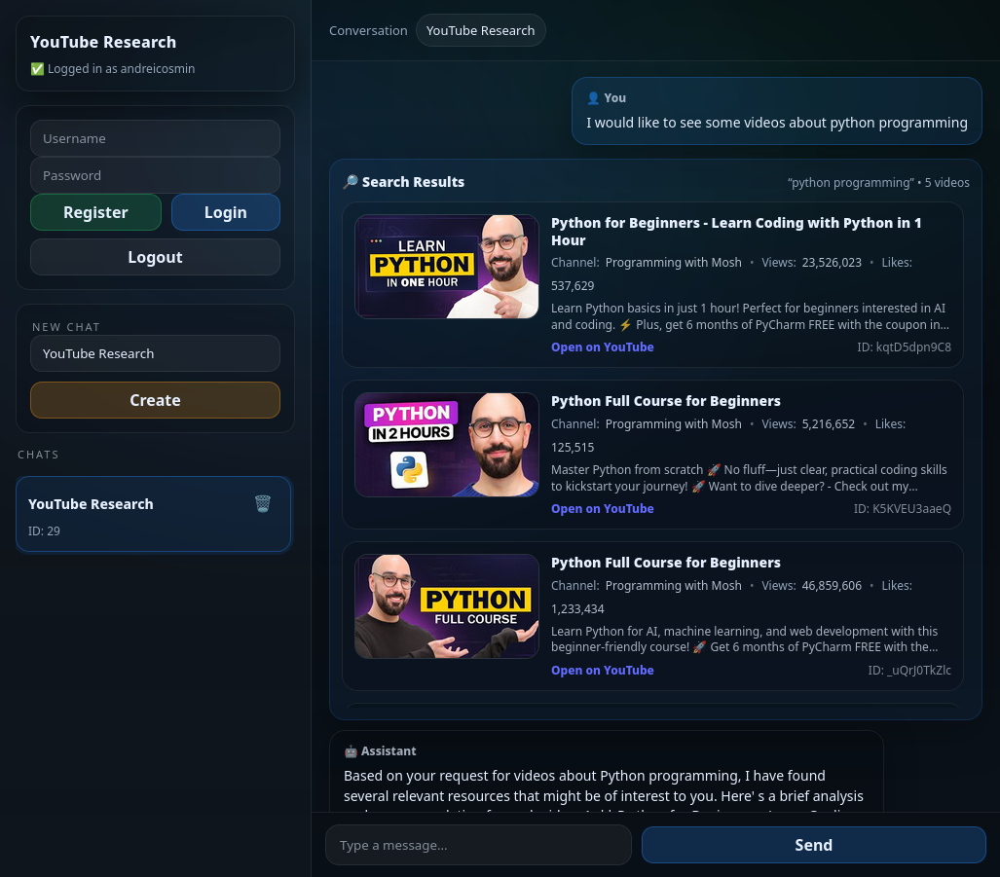

# YouTube Research Agent

YouTube Research Agent is an AI application that routes user messages to different actions (chat, search, video lookup, and comment analysis) through natural conversation.

Users can:

- Start conversations and send free-form messages within them
- Have each message analyzed to determine the appropriate action (chat, search, video lookup, or comment analysis)
- Trigger YouTube searches (basic or advanced) through natural language
- Request detailed analysis of a specific YouTube video
- Request analysis of top-level comments for a YouTube video
- Receive AI-generated responses grounded in live YouTube data
- Receive responses either as a single message or as a streamed token-by-token response via Server-Sent Events (SSE)
- See structured results (videos, comments, metadata) embedded alongside the AI’s textual analysis
- Persist both user messages and assistant responses as part of the conversation history

The system combines a Spring Boot backend, a React-based frontend, PostgreSQL for persistence, and an LLM runtime (via Ollama) to enable conversational research over YouTube content.

## Screenshot



---

## High-Level Architecture

YouTube Research Agent is a containerized, full-stack application composed of four main parts:

- **Frontend** (React, served via Nginx)
- **Backend API** (Spring Boot with WebFlux)
- **Database** (PostgreSQL)
- **LLM Runtime** (LM Studio by default, Ollama-compatible)

All services are orchestrated using Docker Compose.

### Frontend

The frontend provides the user interface for authentication, conversation management, and message exchange.

It communicates with the backend via REST and consumes Server-Sent Events (SSE) to render AI responses incrementally as they are generated.

### Backend API

The backend is a Spring Boot WebFlux application secured with JWT authentication.

It is responsible for:

- User, conversation, and message management
- Enforcing ownership and access control
- Orchestrating AI requests
- Integrating with YouTube and the LLM runtime
- Streaming AI responses via SSE

### LLM Runtime

The backend connects to an external LLM runtime via the `OLLAMA_BASE_URL` environment variable.

By default, this points to **LM Studio** running on the host machine.  
Alternatively, users can run **Ollama** using the provided Docker service and update the base URL accordingly.

The LLM is treated as a stateless inference service; all state and control flow live in the application.

### Persistence

PostgreSQL stores users, conversations, and messages.

Conversation context is reconstructed dynamically from stored messages and truncated to a fixed size to control prompt length.

### Docker & Local Deployment

The project is designed to run entirely via Docker Compose for local development.

The Compose setup defines:

- **PostgreSQL** for persistence
- **Backend API** (Spring Boot)
- **Frontend** (React served by Nginx)
- **Optional Ollama runtime** for local LLM inference

The backend connects to the LLM runtime via the `OLLAMA_BASE_URL` environment variable.  
By default, this points to a host-level LM Studio instance, but it can be switched to the Ollama container if desired.

---

## Tech Stack

### Backend

- **Java**
- **Spring Boot** (WebFlux)
- **Spring Security** (JWT-based authentication)
- **Spring Data JPA**
- **PostgreSQL** (production and Docker)
- **H2** (tests)
- **Jackson** (JSON serialization)
- **Project Reactor** (reactive streams, SSE)

### Frontend

- **React**
- **Vite**
- **Nginx** (static asset serving)
- **Server-Sent Events (SSE)** for streaming responses

### AI / LLM

- **LM Studio** (default runtime)
- **Ollama-compatible API**
- LLM accessed via HTTP using a configurable base URL

### External APIs

- **YouTube Data API v3**
  - Video search
  - Video metadata
  - Top-level comment retrieval

### Infrastructure & Tooling

- **Docker & Docker Compose**
- **Maven**
- **PostgreSQL**
- **Nginx**

---

## Project Setup

The project can be run either fully via Docker Compose or partially using local services.
The backend is configurable via environment variables and standard Spring Boot properties.

### Prerequisites

- **Docker** and **Docker Compose**
- **Java 17** (only required if running the backend outside Docker)
- **Node.js** (only required if running the frontend outside Docker)
- **LM Studio** running locally (default LLM runtime), or **Ollama**
- **YouTube Data API key**

### Environment Configuration

The project relies on environment variables for configuration.
These can be defined in a .env file (for Docker Compose) or exported in your shell.

### Environment Variables

Database

```env
    POSTGRES_DB=youtube_research
    POSTGRES_USER=postgres
    POSTGRES_PASSWORD=password
    POSTGRES_PORT=5432
```

When running via Docker Compose, PostgreSQL runs in a container.
When running the backend locally, it connects to a PostgreSQL instance on localhost.

## Backend

```env
    SPRING_PORT=8080

    JWT_SECRET=mysecretkeythatisatleast32characterslong
    JWT_EXPIRATION=86400000

    YOUTUBE_API_KEY=your_api_key_here
```

## LLM Runtime

```env
# Ollama-compatible runtime (LM Studio by default)
OLLAMA_PORT=11434
OLLAMA_MODEL=mistral
```

The backend connects to the LLM runtime using the following Spring properties:

```env
ollama.base-url=http://localhost:1234
ollama.model=mistralai/mistral-7b-instruct-v0.3
```

By default:

- LM Studio is expected to run on http://localhost:1234
- The API is Ollama-compatible
- The model name is configurable but not enforced by the backend

## Running with Docker Compose (Recommended)

```env
docker compose up --build
```

This starts:

- PostgreSQL
- Backend API
- Frontend
- Optional Ollama container

Once running:

- Frontend: http://localhost
- Backend API: http://localhost:8080

---

## Notes & Limitations

- The application requires a valid **YouTube Data API key** to enable search and analysis features.
- The LLM runtime is treated as a **stateless inference service**; conversation state is managed entirely by the backend.
- Model availability and performance depend on the selected LLM runtime (LM Studio or Ollama).
- Streaming responses rely on **Server-Sent Events (SSE)** and require client support.
- This project is intended for local development and experimentation; it is not production-hardened out of the box.

---

## License

MIT License. See the [LICENSE](LICENSE) file for details.
